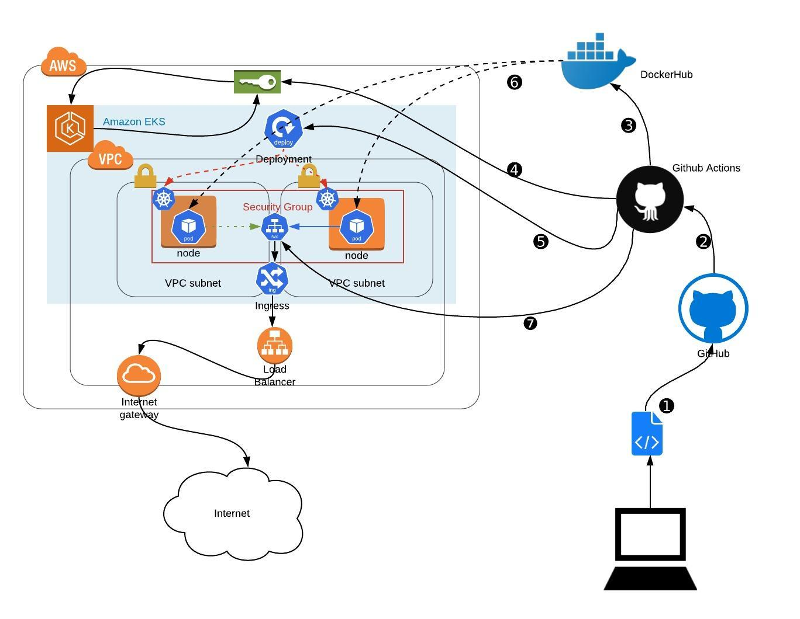

# happybirthday

## github action pipline
you must set at least thise secrets for this pipeline

`DOCKERHUB_USERNAME`
`DOCKERHUB_PASSWORD`
`AWS_Access_Key_ID`
`AWS_Secret_Access_Key`

### github pipeline steps
* Test with pytest
* Build the Docker image and Push to DockerHub
* Deploy to AWS Kubernetes Cluster

> Notic: Deployment Method on the Kubernetes is Blue/Green Method



## for testing prod deployment
> it is from local without loadbalancer or any nginx ingress from public
> notice you must have access from you local machine to cluster by kubectl

` kubectl port-forward NAME_OF_THE_POD 5000:5000`
`curl -d '{"username":"emir", "dateOfBirth":"1981-01-02"}' -H "Content-Type: application/json" -X POST localhost:5000/user`
or
`curl -H "Content-Type: application/json" localhost:5000/`

## python local test

`python3 -m venv venv`

`source venv/bin/activate`

`pip3 install -r requirements.txt`

`pytest test.py`

`curl -d '{"username":"emir", "dateOfBirth":"1981-01-02"}' -H "Content-Type: application/json" -X POST localhost:5000/user`

## sqlite table

```
CREATE TABLE user (
    id INTEGER PRIMARY KEY,
    username TEXT NOT NULL UNIQUE,
    dateOfBirth TEXT NOT NULL
);
```
